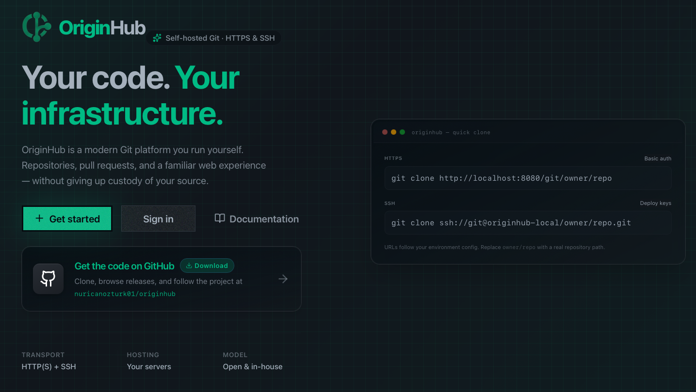

<div align="center">

<br/>


<h3>A simple, self-hosted Git registry — your code, your server, your rules.</h3>

<br/>

[](https://openjdk.org/)
[](https://spring.io/projects/spring-boot)
[](https://angular.dev)
[](https://tailwindcss.com/)
[](https://www.postgresql.org/)
[](https://redis.io/)
[](https://prometheus.io/)
[](https://grafana.com/)
[](https://www.docker.com/)
[](README.md#multi-instance-deployment)
[](LICENSE)

<br/>

[✨ Features](#-features) · [🎬 Demo](#-demo) · [🛠 Tech Stack](#-tech-stack) · [🚀 Getting Started](#-getting-started) · [🗺 Roadmap](#-roadmap) · [📄 License](#-license)

<br/>

</div>

---

## 🔍 What is OriginHub?

OriginHub is a simple, open-source, self-hosted Git registry inspired by GitHub. It gives you full control over your repositories, pull requests, and CI/CD pipelines — running entirely on your own infrastructure, with zero dependency on third-party platforms.

No subscriptions. No data leaving your servers. No vendor lock-in. Just Git, hosted your way.

OriginHub is built for developers and teams who care about ownership — whether you're an indie developer running it on a VPS, or an enterprise team deploying it on private infrastructure. If you've ever thought *"I wish GitHub ran on my own server"*, OriginHub is for you.

---

## 🎬 Demo

<div align="center">

<a href="https://youtu.be/mis1Za2800E">
  
</a>

**[Watch on YouTube →](https://youtu.be/mis1Za2800E)**

</div>

---

## ✨ Features

OriginHub covers the full Git hosting loop — repos, review, browsing, issues, project boards, releases, webhooks, code snippets, and collaborator access — plus **enterprise SAML/LDAP SSO**, **platform admin tooling**, **rate limiting**, **Prometheus/Grafana observability**, and **audit logging** — all on your own infrastructure.

<div align="center">

| | | |
|:---:|:---:|:---:|
| 📁 [Repository Management](#-repository-management) | 👤 [Public Profiles](#-public-profile) | 📥 [GitHub Migration](#-github-repository-migration) |
| 🗂 [Code Browsing](#-code-browsing) | 🔀 [Pull Requests](#-pull-requests) | 🐛 [Issues](#-issues) |
| 📋 [Project Boards](#-project-management-kanban) | 📝 [Code Snippets](#-code-snippets-gist-like) | 🏷 [Tags & Releases](#-tags--releases) |
| 🔔 [Webhooks](#-webhooks) | 🔐 [Authentication](#-authentication) | 👥 [Collaborators](#-collaborators) |
| 🍴 [Repository Forks](#-repository-forks) | 🛡 [Access Policies](#-repo-access-policies) | 🏢 [Enterprise SSO](#-enterprise-saml--ldap-sso) |
| 📊 [Admin Panel](#-admin-panel) | ⚡ [Rate Limiting](#-rate-limiting) | 📈 [Observability](#-prometheus--grafana-observability) |
| 📜 [Audit Logging](#-audit-logging) | ⚡ [Actions *(soon)*](#-actions--cicd-coming-soon) | |

</div>

---

### 📁 Repository Management

- Create, clone, push, and pull repositories
- **Public and private** repositories, descriptions, and **topics**
- **Git over HTTP and HTTPS (TLS)**: smart HTTP backend at `/git/…` — use `http://` or `https://` remote URLs with your OriginHub host
- **SSH** Git on a configurable port (default **2222** in Docker)
- Per-repo **Settings**: general metadata, optional **auto-delete head branch** after PR merge or close

### 👤 Public Profile

- Every account has a public profile at `/:username` showing public repositories
- Optional **profile README** rendered from the account's special repository
- Paginated public repository list

### 📥 GitHub Repository Migration

- **Migrate from GitHub** with a repository URL and **personal access token** (classic or fine-grained with repo read)
- **Mirror clone** the Git history into your OriginHub account
- Optionally migrate **pull requests** from GitHub in the same job

### 🗂 Code Browsing

- File tree with breadcrumbs; blob viewer and **raw** file URLs
- **Markdown README** on the repo home (images and relative links resolved like on GitHub)
- Commit history and diffs

### 🔀 Pull Requests

- Open, review, merge, or close PRs
- Merge strategies: **merge commit**, **squash**, **rebase**
- Draft PRs, inline discussion, file-level comments

### 🐛 Issues

- Track bugs and feature requests per repository
- Labels, comments, open/close status
- **Link issues to Kanban tasks** — resolving a PR can auto-complete linked tasks

### 📋 Project Management (Kanban)

- **Projects** with **boards** and configurable **columns** (per-project)
- **Tasks** and **subtasks** with types, status, assignee, and ordering
- Create **Git branches** from a task or subtask (conventional branch names, e.g. `TASK-1` or `TASK-1.SUB-1-…`)
- **Link** a branch's pull request to the task or subtask; see PR status on the card
- **Optional automation** (per project): when a linked PR is **merged**, mark the task or subtask **completed**
- **Project settings** page for the above PR → status behaviour
- Projects linked to a repository are paginated in the repo's **Projects** tab

### 📝 Code Snippets (Gist-like)

- Create **public** or **private** snippets with syntax-highlighted code blocks
- **Multi-file** support per snippet
- Full **revision history** — track edits and diff between revisions
- **Fork** any public snippet
- Paginated snippets per repository in the repo's **Snippets** tab
- Manage all your snippets from the **Snippets** section in the app bar

### 🔔 Webhooks

- **Signed HTTP delivery** (`X-Hub-Signature-256`) to your services for pushes, PR events, and more
- **Automatic retries** (3 attempts, exponential back-off) on delivery failure
- **Dead-letter queue (DLQ)** — permanently failed deliveries are queued and retried on a schedule; admin can inspect and replay from the admin panel
- **Per-host circuit breaker** (Resilience4j) — when a target endpoint fails repeatedly the circuit opens; subsequent deliveries go straight to the DLQ instead of burning retries; circuit auto-recovers when the endpoint comes back
- Configured per-repository in **Settings → Webhooks**

### 🏷 Tags & Releases

- Create **lightweight and annotated tags** on any commit via the UI
- **Draft or publish releases** tied to a tag — write release notes with Markdown
- **Upload release assets** (binaries, archives, checksums) directly from the browser
- Browse all releases in the repo's **Releases** tab; latest release shown on the repo home
- **Delete** releases or tags from the UI (tag is removed from the underlying Git repo)
- **Release badge** on the repo home shows the latest published version at a glance

### 👥 Collaborators

- Invite other OriginHub users to your repository with **fine-grained per-permission roles**
- Available permissions (each toggled independently): **Push**, **Pull Request management**, **Issue management**, **Settings access**, **Admin** (all permissions)
- Share an **invite link** with a configurable expiry — recipient accepts via the link, no admin approval needed
- Manage active collaborators and revoke access at any time from **Settings → Collaborators**
- Collaborators inherit the base repo visibility — private repos remain private to non-collaborators
- **How to invite:** go to your repository → Settings → Collaborators → *Invite* → pick permissions → copy the generated link and send it to the person you want to add

### 🍴 Repository Forks

- Fork any public repository to your own account with a single click
- Fork preserves the full commit history of the upstream repo at the time of forking
- Work on your fork independently — push branches, open issues, create snippets
- Open a **pull request from your fork** back to the upstream repository to propose changes
- **How to fork:** navigate to any public repository → click **Fork** in the top-right area of the repo header

### 🛡 Repo Access Policies

- Define **access rules** per repository that apply on top of base visibility
- Policies control what authenticated (non-owner, non-collaborator) users can do — e.g. **allow public read but restrict push**, or **allow fork but restrict issue creation**
- Useful for organizations that want open-source-style read access without enabling arbitrary contributions
- Configured in **Settings → Access Policies**; changes take effect immediately for all subsequent requests

### ⚡ Actions — CI/CD *(coming soon)*

- YAML workflows, job/step execution, SSE logs, run history, triggers (push / PR / manual)

### 🏢 Enterprise SAML & LDAP SSO

- **Per-organization identity** — map email domains to a SAML 2.0 IdP or corporate LDAP directory
- **SAML 2.0 service provider** — metadata URI, connection test, cached IdP XML, SP entity ID override
- **LDAP directory auth** — manager bind, user search base/filter, email and display-name attributes, optional group mapping
- **Work-email login flow** — users enter work email on the login page; OriginHub routes to the correct org and provisions accounts on first successful sign-in
- **Mutually exclusive per org** — SAML and LDAP cannot both be enabled on the same organization
- Configure in the **admin panel** (`originhub-admin-panel`, port **4300** in local dev)

### 📊 Admin Panel

Separate Angular app for **platform administrators** (not repo owners):

- **Dashboard** — users, repositories, organizations, storage; activity tables (daily/weekly); top contributors; cached stats
- **Users** — search, enable/disable accounts
- **Organizations** — create, edit, delete; configure **SAML** or **LDAP** per org; test connections before enabling
- **Audit log API** — query application audit events (`GET /api/admin/audit-logs`)

See [`originhub-admin-panel/README.md`](originhub-admin-panel/README.md) for setup. Requires `ORIGINHUB_PLATFORM_ADMIN_USERNAMES` and bootstrap admin credentials.

### ⚡ Rate Limiting

- Redis-backed sliding-window limits on sensitive endpoints
- Covers authentication (login, register, password recovery), repo/PR/issue creation, webhooks, tags, snippets, and SSO/LDAP discovery
- Returns **429** with `rateLimitExceeded` when limits are hit

### 📈 Prometheus & Grafana Observability

- **Micrometer** metrics exported at `/actuator/prometheus` (toggle with `ORIGINHUB_OBSERVABILITY_ENABLED`)
- **Docker Compose** includes Prometheus (**9090**) and Grafana (**3000**, admin / admin) with a pre-provisioned OriginHub dashboard
- Scrape targets: app container (`originhub:8080`) or host-run backend (`host.docker.internal:8080`)
- **Circuit breaker health** at `/actuator/circuitbreakers` — real-time `CLOSED / OPEN / HALF_OPEN` state for webhook delivery and SAML metadata circuit breakers; included in `/actuator/health` details

### 📜 Audit Logging

- **Application audit log** — `@Audited` actions persisted to partitioned `audit_logs` tables (append-only triggers)
- **Admin API** — paginated queries by actor and recent window
- **pgAudit** — custom Postgres image logs write, DDL, and role operations to container stderr (`shared_preload_libraries=pgaudit`)
- Toggle application audit with `ORIGINHUB_AUDIT_ENABLED` (default `true`)

### 🔐 Authentication

- Bearer Auth username + password with JWT
- Basic Auth for git repo operations
- OAuth2: **Google**, **GitHub**, **GitLab**
- SSH public keys for Git over SSH
- **Enterprise SAML 2.0** and **LDAP** per organization (see above)

---

## 🛠 Tech Stack

| Layer       | Technology                                       |
|-------------|--------------------------------------------------|
| Language    | Java 25                                          |
| Framework   | Spring Boot 4, Spring Security, Spring Data JPA  |
| Git Engine  | Eclipse JGit                                     |
| SSH Server  | Apache MINA SSHD                                 |
| Auth        | JWT, OAuth2 (Google · GitHub · GitLab), SAML 2.0, LDAP |
| Database    | PostgreSQL 17 + Flyway, pgAudit                |
| Cache       | Redis (cache + rate limiting)                    |
| Observability | Micrometer, Prometheus, Grafana              |
| Resilience  | Resilience4j circuit breakers (webhook delivery, SAML metadata) |
| Audit       | Application audit log (partitioned PostgreSQL)   |
| Frontend    | Angular 21, TypeScript 5                         |
| Admin UI    | Angular 21 (`originhub-admin-panel`)             |
| Styling     | Tailwind CSS 4, DaisyUI 5                        |
| Container   | Docker (multi-stage build, single image)         |

---

## 🚀 Getting Started

> 📖 Full documentation: **[originhub.nuricanozturk.com/docs](https://originhub.nuricanozturk.com/docs)** *(documentation only — not deployed to cloud)*

### Option 1 — Docker Run

```bash
SECRET=$(openssl rand -base64 64 | tr -d '\n')
docker network create originhub

# Infrastructure (Postgres with pgAudit, Redis, Prometheus, Grafana)
docker compose up -d

docker run -d \
  --name originhub \
  --network originhub \
  -p 8080:8080 \
  -p 2222:2222 \
  -e SPRING_DATASOURCE_URL=jdbc:postgresql://originhub-postgres:5432/originhub \
  -e SPRING_DATASOURCE_USERNAME=admin \
  -e SPRING_DATASOURCE_PASSWORD=admin123 \
  -e "ORIGINHUB_JWT_SECRET=$SECRET" \
  -e ORIGINHUB_GIT_REPO__ROOT=/data/repos \
  -e SPRING_DATA_REDIS_HOST=originhub-redis \
  -e SPRING_DATA_REDIS_PORT=6379 \
  -e SPRING_PROFILES_ACTIVE=os \
  -e ORIGINHUB_OBSERVABILITY_ENABLED=true \
  -e ORIGINHUB_AUDIT_ENABLED=true \
  -v originhub-repos:/data/repos \
  repo.repsy.io/nuricanozturk/originhub/originhub-os:latest
```

### Option 2 — Makefile + Docker Compose (recommended)

```bash
git clone https://github.com/nuricanozturk01/originhub.git
cd originhub
make up          # Postgres (pgAudit) + Redis + Prometheus + Grafana + app
```

Edit the variables at the top of the `Makefile` before running — at minimum review `JWT_SECRET`. OAuth2 and SSO keys are optional.

| Service     | URL                          |
|-------------|------------------------------|
| App         | http://localhost:8080        |
| SSH Git     | localhost:2222               |
| Prometheus  | http://localhost:9090        |
| Grafana     | http://localhost:3000 (admin / admin) |
| Admin panel | http://localhost:4300 (dev — run separately) |

**Admin panel (local dev):**

```bash
cd originhub-admin-panel && pnpm install && pnpm start
# Sign in with bootstrap admin (see application-local.yaml)
```

| Target               | Description                                     |
|----------------------|-------------------------------------------------|
| `make up`            | Infra (Compose) + app container                 |
| `make down`          | Stop and remove all containers                  |
| `make infra`         | Postgres + Redis + Prometheus + Grafana only    |
| `make app`           | Start app container only (single instance)      |
| `make app-scale N=3` | Start N app instances (internal only, no external ports) |
| `make app-scale-stop N=3` | Stop N app instances                             |
| `make proxy`         | Start HAProxy (HTTP `:8080`, SSH `:2222`) for scaled instances |
| `make proxy-stop`    | Stop HAProxy                                    |
| `make up-ha N=3`     | Full HA stack: infra + N instances + proxy      |
| `make ldap-up`       | Start Docker OpenLDAP for LDAP E2E / testing    |
| `make saml-keygen`   | Generate SP signing key pair (~/.originhub/saml/) |
| `make logs`          | Follow app logs                                 |
| `make logs-prometheus` / `make logs-grafana` | Observability logs        |
| `make ps`            | List running containers                         |
| `make purge`         | Remove everything including repo data ⚠️        |

### Multi-Instance Deployment

OriginHub supports production horizontal scaling. All critical shared-state concerns are handled:

```bash
make infra            # Postgres, Redis, Prometheus, Grafana
make app-scale N=3    # 3 instances (no external ports — routed via proxy)
make proxy            # HAProxy: HTTP on :8080, SSH on :2222

# Or all at once:
make up-ha N=3
```

All instances share:
- **`originhub-repos` Docker volume** — Git repo data; JGit file-level locking handles concurrent access
- **Redis** — DLQ retry lock (one instance per window), rate limiting, response cache, **and circuit breaker state**
- **PostgreSQL** — all application state, Modulith event publication table

**Circuit breaker state is shared across instances** via `DistributedCircuitBreakerGuard`: when any instance opens a CB for a webhook host (e.g. `webhook.example.com`), a Redis key is set with the CB's wait-duration as TTL. All other instances check Redis before attempting delivery — they immediately route to DLQ without burning retries.

**SSH + HTTP load balancing** via HAProxy (`proxy/haproxy.cfg`):
- SSH (`leastconn` balance) — distributes Git-over-SSH connections, honours long-lived session timeouts
- HTTP (`roundrobin`) — distributes API/web traffic
- TCP health checks — down instances are removed automatically, no manual intervention needed
- Static backends for `originhub` + `originhub-1` through `originhub-4` (edit cfg to add more)

Known limitations:
- **Admin stats cache** is per-instance in-memory. Minor TTL-based inconsistency across instances — no correctness issue.
- **Max 4 scaled instances** with the default HAProxy config. Edit `proxy/haproxy.cfg` to add more backends.

### Environment Variables

| Variable                       | Required | Default               | Description                          |
|--------------------------------|----------|-----------------------|--------------------------------------|
| `ORIGINHUB_JWT_SECRET`         | ✅        | —                     | Min 32-char secret for JWT signing   |
| `ORIGINHUB_BOOTSTRAP_ADMIN_USERNAME` |   | `admin`               | First-start platform admin username  |
| `ORIGINHUB_BOOTSTRAP_ADMIN_PASSWORD` | ✅ prod | —                 | Bootstrap admin password (empty skips) |
| `ORIGINHUB_PLATFORM_ADMIN_USERNAMES` |   | —                     | Comma-separated platform admin usernames |
| `ORIGINHUB_GIT_REPO__ROOT`     |          | `/data/repos`         | Git repository storage path          |
| `ORIGINHUB_FRONTEND_BASE_URL`  |          | `http://localhost:8080` | Public base URL                    |
| `ORIGINHUB_CORS_ALLOWED_ORIGINS` |       | `4200,4300`           | CORS origins (include admin panel)   |
| `ORIGINHUB_AUDIT_ENABLED`      |          | `true`                | Application audit log                |
| `ORIGINHUB_OBSERVABILITY_ENABLED` |       | `true`                | Prometheus `/actuator/prometheus`    |
| `ORIGINHUB_SSO_SAML_ENABLED`   |          | `false`               | Global SAML feature flag             |
| `ORIGINHUB_SSO_LDAP_ENABLED`   |          | `false`               | Global LDAP feature flag             |
| `ORIGINHUB_SSO_SAML_SP_SIGNING_KEY_PATH` | | —                   | SP signing private key (SAML)        |
| `ORIGINHUB_SSO_SAML_SP_SIGNING_CERT_PATH` | | —                   | SP signing certificate (SAML)        |
| `SPRING_DATA_REDIS_HOST`       |          | `originhub-redis`     | Redis hostname                       |
| `SPRING_DATA_REDIS_PORT`       |          | `6379`                | Redis port                           |
| `OAUTH2_GOOGLE_CLIENT_ID`      |          | —                     | Google OAuth2 client ID              |
| `OAUTH2_GOOGLE_CLIENT_SECRET`  |          | —                     | Google OAuth2 client secret          |
| `OAUTH2_GITHUB_CLIENT_ID`      |          | —                     | GitHub OAuth2 client ID              |
| `OAUTH2_GITHUB_CLIENT_SECRET`  |          | —                     | GitHub OAuth2 client secret          |
| `OAUTH2_GITLAB_CLIENT_ID`      |          | —                     | GitLab OAuth2 client ID              |
| `OAUTH2_GITLAB_CLIENT_SECRET`  |          | —                     | GitLab OAuth2 client secret          |

---

## 🗺 Roadmap

OriginHub is under active development. Here's what's planned:

- [x] HTTPS Git support
- [x] GitHub repo migration
- [x] Project board (Kanban) integrated with repositories
- [x] Code snippets (Gist-like)
- [x] Repo issues
- [x] Public repositories
- [x] Public profile and README
- [x] Webhooks
- [x] Tags and releases
- [x] Collaborators with fine-grained permissions and invite links
- [x] Repository forks with cross-fork pull requests
- [x] Repo access policies
- [x] Enterprise SAML & LDAP SSO (per-organization)
- [x] Platform admin panel (stats, users, organizations)
- [x] Redis-backed rate limiting
- [x] Prometheus & Grafana observability
- [x] Application audit log + pgAudit PostgreSQL
- [x] Webhook dead-letter queue (DLQ) with scheduled retry
- [x] Circuit breakers (Resilience4j) for webhook delivery and SAML metadata
- [x] JaCoCo CI coverage gate
- [x] Multi-instance deployment (Redis distributed lock, shared volume)
- [ ] Actions — CI/CD
- [ ] [Repsy](https://github.com/repsyio/repsy) package management integration
- [ ] Two-factor authentication (TOTP)

---

## 📄 License

Distributed under the [MIT License](LICENSE.txt).

---

## ☕ Support

<div align="center">

If OriginHub saves you time or you just want to say thanks, consider buying me a coffee. It keeps the project alive and the commits coming.

<a href="https://www.buymeacoffee.com/nuricanozturk" target="_blank">
  
</a>

</div>
